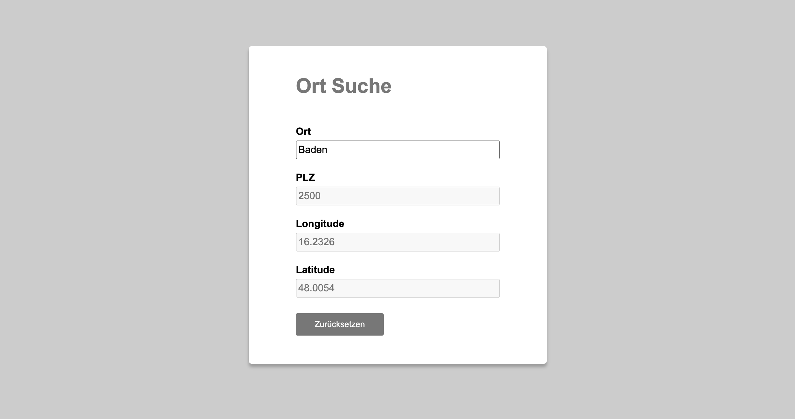

# Ort‐Suche (Demo)

## Beschreibung

Diese Web-App bietet eine einfache Benutzeroberfläche mit vier Eingabefeldern: Ort, PLZ (schreibgeschützt), Längengrad (schreibgeschützt) und Breitengrad (schreibgeschützt). Während der Eingabe des Ortes erhält der Benutzer Live-Suchvorschläge. Die PLZ wird über eine Web-API abgerufen, und mit dieser PLZ werden über eine weitere Web-API die Koordinaten (Breitengrad und Längengrad) ermittelt. Die ermittelten Werte werden dann im Formular angezeigt.

Die Web-App wurde im Rahmen einer IT-Ausbildung am WIFI Wien für eine Pflichtübung **(Modul: Programmieren mit JavaScript ‐ Aufbau)** entwickelt.

## Funktionen

### Live-Suche
Der Benutzer erhält während der Eingabe des Ortes automatisch Vorschläge, um die Suche zu erleichtern.
  
### Automatische PLZ-Ermittlung
Sobald der Benutzer einen Ort auswählt, wird automatisch die entsprechende PLZ abgerufen und im Formular angezeigt.
  
### Koordinatenabfrage
Mit der PLZ wird automatisch über eine Web-API die zugehörige Breitengrad und Längengrad ermittelt und im Formular ausgegeben.

### Error-Handling mit Try-Catch
Die Verwendung von Try-Catch-Blöcken in der ermöglicht es, Fehler abzufangen und darauf zu reagieren und erleichtert auch das Debuggen des Codes.

### Responsives Design
Die Website wurde entwickelt, um auf verschiedenen Geräten und Bildschirmgrößen gut auszusehen und zu funktionieren. Dies gewährleistet eine optimale Benutzererfahrung, unabhängig davon, ob die Website auf einem Desktop-Computer, Tablet oder Smartphone angezeigt wird.

## Technologien

HTML, CSS, JavaScript

## Ausgabe

